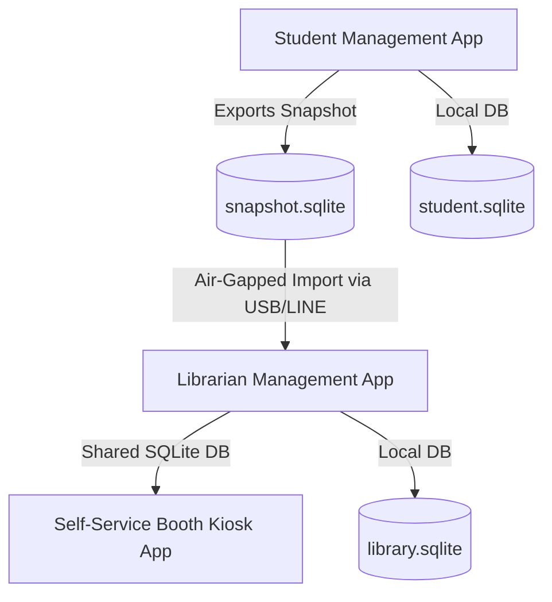

# School Project Architecture Overview

## 1. System Topology
The system consists of three independent desktop GUI applications written in **Python 3.14** and **PySide6 (Qt Quick / QML)**, backed by local **SQLite** databases:



### The Three Applications:
1. **Student Management App (`apps/student_management_app`)**:
   - Manages student records, enrollments, classroom assignments, yearly promotions, and Excel imports.
   - Authoritative source for student identities.
   - Exports signed/checksummed `snapshot.sqlite` for the library system.
2. **Librarian Management App (`apps/librarian_management_app`)**:
   - Manages book catalog, barcode printing (A4 PDF label sheets), active loans, overdue fines, and categories.
   - Ingests student snapshot diffs from Student Management.
3. **Self-Service Booth Kiosk (`apps/booth_app`)**:
   - High-speed student checkout and return station.
   - Designed for barcode scanner inputs and touch screens.
   - Directly connects to `library.sqlite`.

---

## 2. Layered Architecture

```
┌──────────────────────────────────────────────────────────┐
│                   QML Presentation Layer                 │
│  - Main.qml                                              │
│  - apps/common_qml/ (StyledSearchField, PaginationBar)    │
│  - apps/<app>/qml/views/ (Modular Views)                 │
│  - apps/<app>/qml/dialogs/ (Action Dialogs)              │
└────────────────────────────┬─────────────────────────────┘
                             │ PySide6 @Slot / Signal
┌────────────────────────────▼─────────────────────────────┐
│                     UI Adapters Layer                    │
│  - StudentAdminAdapter, LibrarianAdminAdapter, BoothAdapter│
│  - Serialization to JSON & _sanitize_for_qml             │
└────────────────────────────┬─────────────────────────────┘
                             │ Returns Result[T, E]
┌────────────────────────────▼─────────────────────────────┐
│                    Core Services Layer                   │
│  - StudentService, EnrollmentService                     │
│  - CatalogService, LoanService, FineService              │
│  - xlsx_diff_importer, build_db                          │
└────────────────────────────┬─────────────────────────────┘
                             │ SQL Queries / Transactions
┌────────────────────────────▼─────────────────────────────┐
│                   Data & Persistence Layer               │
│  - student_repo, catalog_repo, loan_repo, log_repo       │
│  - SQLite with FTS5 trigram + PRAGMA encryption          │
└──────────────────────────────────────────────────────────┘
```

---

## 3. Key Design Principles
1. **Single Source of Truth**: Student master data originates in Student Management and syncs to Library via snapshot diffs.
2. **Crash-Proof QML**: Adapters sanitize all database rows with `_sanitize_for_qml` to prevent null-role crashes and undefined type mismatches in QML bindings.
3. **Rust-Style `Result[T, E]`**: Business logic never throws unhandled exceptions; operations return `Ok(data)` or `Err(error)` with optional warnings.
4. **Air-Gapped & Resilient**: Works 100% offline without cloud or network dependencies.
