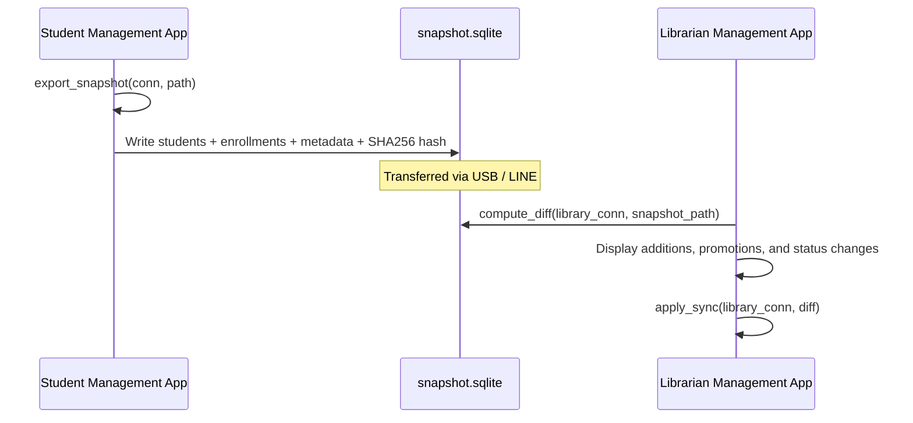

# Air-Gapped Sync & Snapshot Architecture (`data/sync/`)

## 1. Motivation
The school system operates in an air-gapped environment where the Registrar's office (Student Management) and the Library (Librarian App) may not share a live local area network. Student updates are transferred periodically using USB flash drives or LINE attachments.

---

## 2. Sync Pipeline

---

## 3. Modules Reference

### 3.1 `export.py` (`export_snapshot`)
- Extracts all active students, current enrollments, and status changes from `student.sqlite`.
- Writes them into a standalone SQLite database (`snapshot.sqlite`).
- Calculates SHA256 checksum and saves it to the `sync_state` table inside the snapshot to detect file corruption during transfer.

### 3.2 `diff.py` (`compute_diff`)
- Compares incoming `snapshot.sqlite` against local `library.sqlite`.
- Categorizes changes into:
  - `new_students`: Students in snapshot not found in library.
  - `updated_students`: Name, status, or classroom changes.
  - `deleted_students`: Students no longer active.

### 3.3 `apply.py` (`apply_sync`)
- Applies the computed diff atomically within a single SQL transaction.
- Preserves all historical loan records and fine balances in `library.sqlite`.
